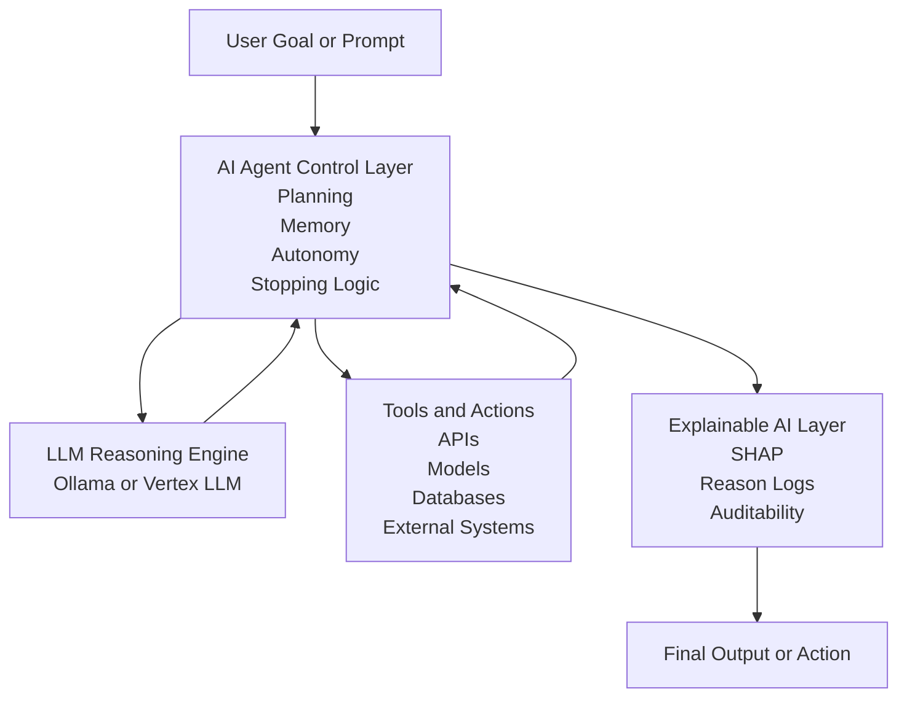
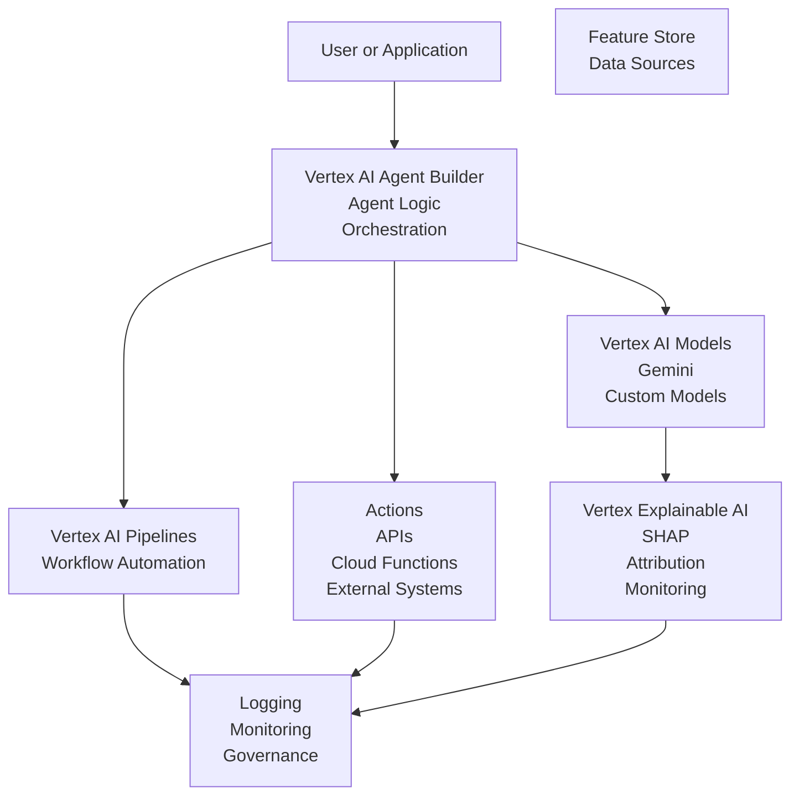

# Tunisia AI Tour 2026 - Google Vertex AI Agent Workshops Series 
(covering all Universities from the North to the south of Tunisia  )

**Building Agentic AI Workflows with xAI - From Code to Action**

This repository contains the full hands-on material used in the **Google Vertex AI Agent Workshop Series**, delivered during the **Tunisia AI Universities Tour 2026** .

It demonstrates how to **build agentic AI systems step by step**, starting from a **local AI agent** and progressing toward **cloud-scale agentic workflows on Google Vertex AI**, with a strong focus on **explainability (xAI)** and responsible AI.

---

## What is Tunisia AI Tour’26?

**Tunisia AI Tour’26** is a nationwide educational journey bringing hands-on **Agentic AI workshops** to universities across Tunisia.

From data to deployment, participants do not just learn AI, they **build real intelligent agents** using industry tools such as **Google Vertex AI**.

Beyond technology, the tour is rooted in impact, with **50 percent of workshop proceeds donated** to people in need through the **Tunisian Red Crescent**.

Education, access, and responsibility moving together across the country. 🇹🇳✨

## Reach Goal : +3000 student !


---

## Repository Structure

```
Google vertex-AI agent-workshop/
│
├── local-ai-agent/                 # Demo 1: Local agent (Ollama + Python)
│   ├── agent.py
│   ├── llm.py
│   ├── main.py
│
├── agent-demo (VScode) demo 2/      # Demo 2: Agentic AI with prediction + actions
│
├── Vertex AI Agent Builder/         # Vertex AI managed agent approach
│
├── Presentation/                   # Slides used during the workshop
├── Ressources/                     # Reading material and references
│
├── GOOGLE VERTEX AI DEMO TAKEWAY.pdf
├── ressources links.pdf
└── README.md
```

---

## What You Will Learn

By following this repository, you will learn how to:

* Understand **Agentic AI vs Generative AI**
* Build a **multi-step autonomous AI agent**
* Separate **LLM reasoning from agent control**
* Implement **planning, memory, autonomy, and stopping logic**
* Add **explainability (xAI)** to agent decisions
* Scale agents to **Vertex AI pipelines and Agent Builder**

This repository is designed for:

* Students
* Developers
* Data scientists
* AI engineers
* Educators running hands-on workshops

---

# Architecture Overview

The workshop follows a **progressive architecture**, starting locally and scaling to Google Vertex AI.

---

## Mermaid Diagram - Agentic AI Architecture (GitHub Rendered)



---

## Why This Architecture Matters

* The **LLM is not the agent**
* The agent owns planning, memory, and decisions
* Explainability is built in by design
* The same structure works locally and in production
* This mirrors real enterprise AI systems

---

# DEMO 1: Local Agentic AI (From Scratch)

This demo runs **100 percent locally** using **Ollama** and Python.
No API keys. No cloud required.

[Steps for installation, code, and execution remain exactly as in the previous version]

---

# DEMO 2: Agentic AI + Prediction + xAI

### Scenario

An AI assistant that:

1. Collects data from APIs
2. Runs predictions using a trained model
3. Explains decisions using xAI techniques
4. Acts autonomously
5. Logs every step for traceability

---

# Vertex AI Only Architecture

This section shows how the same agent architecture maps **directly** to Google Cloud Vertex AI.

---

## Mermaid Diagram - Vertex AI Production Architecture



---

## Vertex AI Components Explained

* **Agent Builder**
  Manages agent logic, autonomy, and orchestration

* **Vertex AI Models**
  LLMs and predictive models used for reasoning and inference

* **Vertex Pipelines**
  End to end workflow automation and execution

* **Explainable AI**
  Transparency, trust, and regulatory readiness

* **Governance and Monitoring**
  Logging, auditing, and production safety

---

## Local to Cloud Mapping

| Local Workshop Component | Vertex AI Equivalent  |
| ------------------------ | --------------------- |
| Python Agent             | Agent Builder         |
| Ollama LLM               | Vertex LLMs           |
| Local Memory             | Feature Store         |
| Python Logic             | Pipelines             |
| Logs                     | Cloud Logging         |
| SHAP                     | Vertex Explainable AI |

---

## Teaching Notes

* Chatbots respond
* Agents decide
* xAI explains
* Production systems audit everything

---

## Resources

* [https://docs.cloud.google.com/agent-builder/overview](https://docs.cloud.google.com/agent-builder/overview)
* [https://cloud.google.com/vertex-ai/docs](https://cloud.google.com/vertex-ai/docs)
* [https://codelabs.developers.google.com/building-ai-agents-vertexai](https://codelabs.developers.google.com/building-ai-agents-vertexai)
* [https://cloud.google.com/discover/what-are-ai-agents](https://cloud.google.com/discover/what-are-ai-agents)
* [https://bbycroft.net/llm](https://bbycroft.net/llm)
* [https://n8n.io](https://n8n.io)

---

## Author and Workshop Lead

**Mr. Eng. Manai Mohamed Mortadha**
Senior AI Engineer , Netflix USA
AI Expert Consultant , Tegus USA
PhD Candidate in Explainable AI (xAI) , Saint MAry's University Canada
International AI Speaker ( Linkedin Top AI Voice )
CEO and Head of AI R&D at Man.AI Global
AI Expert Reviewer & Author , Packt Publishing UK

**Links :** 
Social Media :      https://taplink.cc/manaimortadha
LinkedIn Profile :  https://www.linkedin.com/in/mannai-mortadha/
GitHub Portfolio :  https://github.com/MortadhaMannai
Leetcode Profile :  https://leetcode.com/u/mannaimortadha898/
Meduim Blog :       https://www.google.com/url?q=https://manaimortadha.medium.com/
Sessionize Profile: https://www.google.com/url?q=https://sessionize.com/Mortadha_Mannai
Email :             mannaimortadha898@gmail.com

**Tunisia AI Universities Tour 2026**
*Building Agentic AI Workflows with xAI on Google Vertex AI - From Code to Action*

